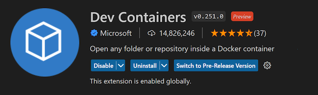
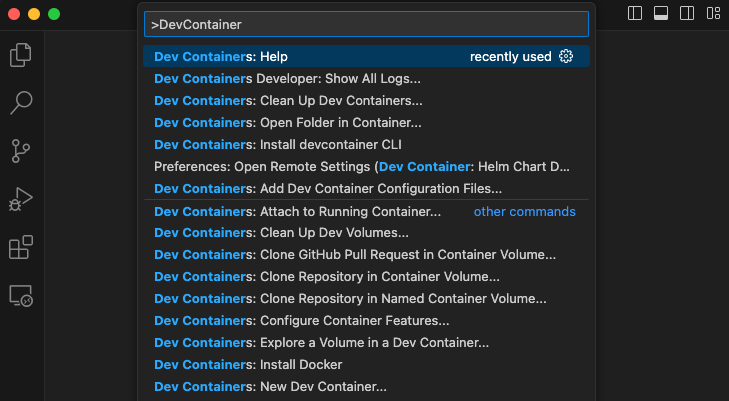

# Splunk Otel Collector Helm Chart Development with DevContainers

## Prerequisites

Before starting, ensure you have the following installed:

- **[Visual Studio Code](https://code.visualstudio.com/download)** - An IDE with powerful development features.
- **[Docker](https://docs.docker.com/engine/install/)** - Essential for running containers and the DevContainer.
- **[Make](https://www.gnu.org/software/make/)** - A build automation tool, used for running defined tasks.

## Getting Started

First, install the Visual Studio [Dev Containers](https://marketplace.visualstudio.com/items?itemName=ms-vscode-remote.remote-containers) extension. You can optinonal go over the [tutorial](https://code.visualstudio.com/docs/devcontainers/tutorial) for how to use this extension.



Next, clone the repository to your local system:

```bash
git clone https://github.com/signalfx/splunk-otel-collector-chart.git
```

Then, open the repository in Visual Studio Code. You'll be prompted to reopen the project in a container in a pop-up window. Select "Reopen in Container" to start the DevContainer.

> **_NOTE:_** If you're not automatically prompted to reopen the project in a container, you can manually start the DevContainer by pressing `F1` to open the command palette, typing "Dev-Containers: Reopen Folder in Container", and hitting `Enter`.

## Starting and Working with the DevContainer

Once your DevContainer is running, you can start developing as if you were working locally. Visual Studio Code's features like IntelliSense, linting, and debugging all work in the DevContainer.
You can also use the [devcontainer-cli](https://code.visualstudio.com/docs/devcontainers/devcontainer-cli) much like you would with other container clis like Docker or Kubernetes.

### Using Visual Studio Code UI



Efficiently manage your DevContainers with Visual Studio Code's Dev Containers command palette:

- **Attach to Running Container**: Press `F1`, type "Dev Containers: Attach to Running Container", and hit `Enter` to connect to a running container.
- **Clean Up Dev Volumes**: Press `F1`, choose "Dev Containers: Clean Up Dev Volumes" to remove unused Docker volumes for a cleaner system.
- **Clone Repository in Container Volume**: Press `F1`, select "Dev Containers: Clone Repository in Container Volume" to clone a Git repository directly into a named Docker volume.
- **Configure Container Features**: Press `F1`, type "Dev Containers: Configure Container Features" to modify or install additional container features.
- **Explore a Volume in a Dev Container**: Press `F1`, select "Dev Containers: Explore a Volume in a Dev Container" to browse the contents of a Docker volume within a Dev Container.
- **Install Docker**: Press `F1`, choose "Dev Containers: Install Docker" to set up Docker within the container if necessary.
- **Open Workspace in Container**: Press `F1`, type "Dev Containers: Open Workspace in Container" to start working in a containerized development environment.
- **Rebuild Container**: Press `F1`, select "Dev Containers: Rebuild Container" to recreate the container from scratch.
- **Reopen Folder Locally**: Press `F1`, type "Dev Containers: Reopen Folder Locally" to switch back to working on your

### Using Github Codespaces Web UI

TODO: Placeholder, see: https://docs.github.com/en/codespaces/setting-up-your-project-for-codespaces/adding-a-dev-container-configuration/introduction-to-dev-containers

### Using Jetbrains Goland UI

TODO: Placeholder, see: https://www.jetbrains.com/help/go/connect-to-devcontainer.html

### Using Make Commands

For those who prefer command-line tools or require scripting capabilities, the following `make` commands can be used to manage the DevContainer:

#### Building the Devcontainer

```bash
make docker-devcontainer-build
```
Builds the project DevContainer as per the `.devcontainer` directory configuration.

#### Pushing the Devcontainer

```bash
make docker-devcontainer-push
```
Pushes the built DevContainer to a registry.

#### Starting the Devcontainer

```bash
make devcontainer-build
```
Prepares the DevContainer for use.

#### Spinning Up the Devcontainer

```bash
make devcontainer-up
```
Starts the DevContainer with settings from `devcontainer.json`.

#### Executing Commands in the Devcontainer

```bash
make devcontainer-exec
```
Executes a command in the DevContainer environment.

#### Stopping the Devcontainer

```bash
make devcontainer-stop
```
Stops and saves the current state of the DevContainer.

#### Shutting Down the Devcontainer

```bash
make devcontainer-down
```
Completely stops and removes the DevContainer.

#### Building the Devcontainer
```bash
make docker-devcontainer-build
```
Builds the project DevContainer as per the `.devcontainer` directory configuration.

#### Pushing the Devcontainer
```bash
make docker-devcontainer-push
```
Pushes the built DevContainer to a registry.

#### Starting the Devcontainer
```bash
make devcontainer-build
```
Prepares the DevContainer for use.

#### Spinning Up the Devcontainer
```bash
make devcontainer-up
```
Starts the DevContainer with settings from `devcontainer.json`.

#### Executing Commands in the Devcontainer
```bash
make devcontainer-exec
```
Executes a command in the DevContainer environment.

#### Stopping the Devcontainer
```bash
make devcontainer-stop
```
Stops and saves the current state of the DevContainer.

#### Shutting Down the Devcontainer
```bash
make devcontainer-down
```
Completely stops and removes the DevContainer.

### Debugging a DevContainer

Debugging a DevContainer largely depends on the specific issue you're facing. However, here are some general tips:

1. **Check the Dockerfile and devcontainer.json files:** Make sure there are no syntax errors or invalid configurations.
2. **Check the build logs:** When you build the DevContainer, Visual Studio Code displays logs in the terminal. These logs can provide useful information about any issues.
3. **Check the Docker daemon:** Ensure that Docker is running properly on your system. You can test this by running a simple command like `docker run hello-world`.
4. **Rebuild the DevContainer:** If you've made changes to the Dockerfile or devcontainer.json, you need to rebuild the DevContainer. You can do this using the "Dev Containers: Rebuild Container" command in the command palette.
5. **Check your system resources:** If your system is low on resources (like memory or disk space), it could cause problems when building or running the DevContainer.

### Recommended Resource Requirements

For the best performance, we recommend the following minimum system resources for running the DevContainer:

- **CPU:** 2 cores
- **Memory:** 6 GB

Please note that these are just recommendations. The actual resources you need could be more or less depending on the specifics of your project. Also, remember that other applications running on your system will also use resources, so make sure to take that into account.

If you're running Docker Desktop, you can adjust the allocated resources in the Docker Desktop settings. For other Docker installations, the process may vary.

### TODOS and Possible Upcoming Features
- Steps for how to use Github Codepspaces with the devcontainer
- Steps for how to use Jetbrains (Goland) with the devcontainer
- Steps for how to pair program remotely using a single devcontainer instance
- Steps on how to spin up a chart demo in the Web UI using Github codespaces
