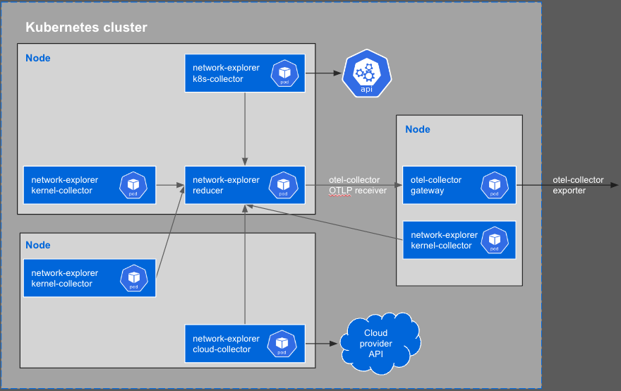

# Network Explorer architecture

Splunk OpenTelemetry Network Explorer is comprised of four components that work together to report network telemetry.  These are:

* The kernel-collector, which collects network data on each Kubernetes node.  The kernel-collectors are deployed as a daemonset.
* The cloud-collector, which gathers cloud provider metadata from the cloud provider's API.
* The k8s-collector, which gathers Kubernetes metadata from the Kubertnetes API.
* The central reducer, which aggregates the data and metadata from the collectors. It sends metrics over the OpenTelemtry Protocol (OTLP) to the OpenTelemetry Collector in gateway mode.

