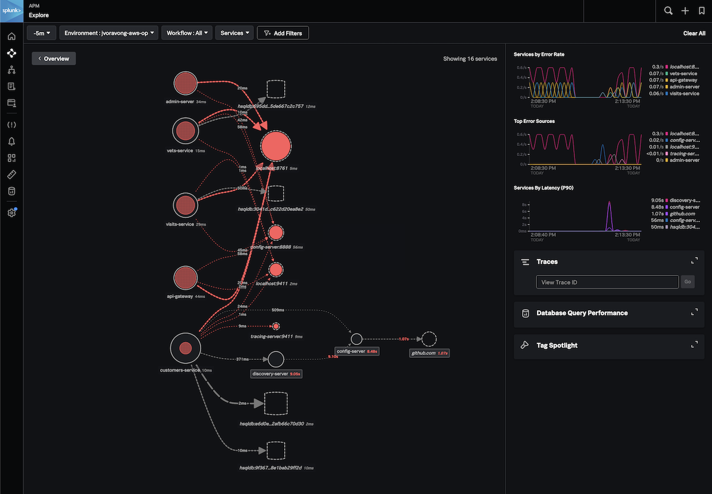
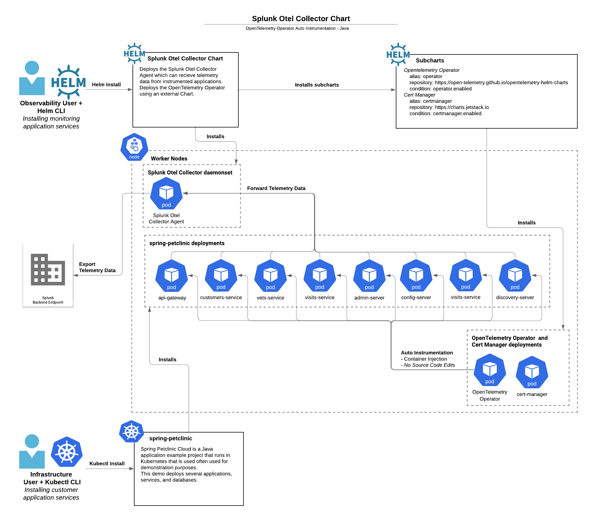

# Example of chart configuration

## How to deploy the OpenTelemetry Operator and Java auto-instrumentation

In the following example we will show how to instrument a project based on
[spring-petclinic-microservices](https://github.com/spring-petclinic/spring-petclinic-microservices).

### 1. Setup the spring-petclinic demo application to instrument

The Java spring-petclinic demo will create a spring-petclinic namespace and deploy the related Java applications to it.
If you have your own Java application you want to instrument, you can still use the steps below as an example for how
to intrument your application.

TODO: Add the Kubernetes manifests for spring-petclinic to this example in a followup PR

```
kubectl apply -f examples/enable-operator-and-auto-instrumentation/spring-petclinic -R
```

### 2. Complete the steps outlined in [Getting started with auto-instrumentation](../../docs/auto-instrumentation-install.md#steps-for-setting-up-auto-instrumentation)

#### 2.1 Deploy the Helm Chart with the Operator enabled

To install the chart with operator in an existing cluster, make sure you have cert-manager installed and available.
Both the cert-manager and operator are subcharts of this chart and can be enabled with `--set certmanager.enabled=true,operator.enabled=true`.
These helm install commands will deploy the chart to the monitoring namespace for this example.

```
# Check if a cert-manager is already installed by looking for cert-manager pods.
kubectl get pods -l app=cert-manager --all-namespaces

# If cert-manager is not already, you can install it with this chart.
helm install splunk-otel-collector -f ./my_values.yaml --set certmanager.enabled=true,operator.enabled=true,environment=dev -n monitoring helm-charts/splunk-otel-collector

# If cert-manager is already installed
helm install splunk-otel-collector -f ./my_values.yaml --set operator.enabled=true,environment=dev -n monitoring helm-charts/splunk-otel-collector
```

#### 2.2 Deploy the opentelemetry.io/v1alpha1 Instrumentation

The Instrumentation object is a spec to configure what instrumentation libraries to use in the target namespace
to use for instrumentation. This Instrumentation will be used to know how to instrument the spring-clinic applications
in the spring-petclinic namespace.

```
kubectl apply -f examples/enable-operator-and-auto-instrumentation/instrumentation.yaml -n spring-petclinic
```

### 2.3 Verify all the OpenTelemetry resources (collector, operator, webhook, instrumentation) are deployed successfully

<details open>
<summary>Expand for kubectl commands to run and output</summary>

```
kubectl  get pods -n monitoring
# NAME                                                          READY
# STATUS    RESTARTS   AGE
# splunk-otel-collector-agent-9ccgn                             2/2     Running   0          3m
# splunk-otel-collector-agent-ft4xc                             2/2     Running   0          3m
# splunk-otel-collector-k8s-cluster-receiver-56f7c9cf5b-mgsbj   1/1     Running   0          3m
# splunk-otel-collector-operator-6dffc898df-5jjkp               2/2     Running   0          3m

kubectl get mutatingwebhookconfiguration.admissionregistration.k8s.io -n monitoring
# NAME                                      WEBHOOKS   AGE
# splunk-otel-collector-certmanager-webhooh 1          8m
# splunk-otel-collector-operator-mutation   3          2m

kubectl get pods -n spring-petclinic
# NAME                                READY   STATUS    RESTARTS        AGE
# admin-server-75d7f4b777-kwq74       1/1     Running   0               2m
# api-gateway-649cc9c68c-9g85j        1/1     Running   0               2m
# config-server-6f7dc87c5f-l8wf5      1/1     Running   0               2m
# customers-service-64c4f875d-m5m64   1/1     Running   0               2m
# discovery-server-65b6d569d6-pf9t6   1/1     Running   0               2m
# vets-service-89b55685c-m9pp5        1/1     Running   0               2m
# visits-service-9689c7b96-k4nm2      1/1     Running   0               2m

kubectl get otelinst -n spring-petclinic
# NAME                          AGE   ENDPOINT
# splunk-instrumentation-java   3m   http://$(SPLUNK_OTEL_AGENT):4317
```

</details>

#### 2.4 Instrument application by setting an annotation

When you get to the `5. Instrument application by setting an annotation` step, you can use the following commands:
<details open>
<summary>Expand for commands to run to add the annotation</summary>

```
# The pods created by spring-petclinic deployments will be restarted with
# instrumentation injected.
kubectl patch deployment admin-server -p '{"spec": {"template":{"metadata":{"annotations":{"instrumentation.opentelemetry.io/inject-java":"true"}}}} }' -n spring-petclinic
kubectl patch deployment api-gateway -p '{"spec": {"template":{"metadata":{"annotations":{"instrumentation.opentelemetry.io/inject-java":"true"}}}} }' -n spring-petclinic
kubectl patch deployment config-server -p '{"spec": {"template":{"metadata":{"annotations":{"instrumentation.opentelemetry.io/inject-java":"true"}}}} }' -n spring-petclinic
kubectl patch deployment customers-service -p '{"spec": {"template":{"metadata":{"annotations":{"instrumentation.opentelemetry.io/inject-java":"true"}}}} }' -n spring-petclinic
kubectl patch deployment vets-service -p '{"spec": {"template":{"metadata":{"annotations":{"instrumentation.opentelemetry.io/inject-java":"true"}}}} }' -n spring-petclinic
kubectl patch deployment discovery-server -p '{"spec": {"template":{"metadata":{"annotations":{"instrumentation.opentelemetry.io/inject-java":"true"}}}} }' -n spring-petclinic
kubectl patch deployment visits-service -p '{"spec": {"template":{"metadata":{"annotations":{"instrumentation.opentelemetry.io/inject-java":"true"}}}} }' -n spring-petclinic

# If you need to disable instrumentation, patch the pod deploymentss with these
# annotations.
kubectl patch deployment admin-server -p '{"spec": {"template":{"metadata":{"annotations":{"instrumentation.opentelemetry.io/inject-java":"false"}}}} }' -n spring-petclinic
kubectl patch deployment api-gateway -p '{"spec": {"template":{"metadata":{"annotations":{"instrumentation.opentelemetry.io/inject-java":"false"}}}} }' -n spring-petclinic
kubectl patch deployment config-server -p '{"spec": {"template":{"metadata":{"annotations":{"instrumentation.opentelemetry.io/inject-java":"false"}}}} }' -n spring-petclinic
kubectl patch deployment customers-service -p '{"spec": {"template":{"metadata":{"annotations":{"instrumentation.opentelemetry.io/inject-java":"false"}}}} }' -n spring-petclinic
kubectl patch deployment vets-service -p '{"spec": {"template":{"metadata":{"annotations":{"instrumentation.opentelemetry.io/inject-java":"false"}}}} }' -n spring-petclinic
kubectl patch deployment discovery-server -p '{"spec": {"template":{"metadata":{"annotations":{"instrumentation.opentelemetry.io/inject-java":"false"}}}} }' -n spring-petclinic
kubectl patch deployment visits-service -p '{"spec": {"template":{"metadata":{"annotations":{"instrumentation.opentelemetry.io/inject-java":"false"}}}} }' -n spring-petclinic

# You can verify instrumentation was success on an individual pod wit the
# following command. If instrumentation was successfull, your application
# container should have the env variable JAVA_TOOL_OPTIONS set and several
# OTEL_* env variables to values that are similiar to the output below.
kubectl describe pod spring-petclinic-9d5bc5fff-5r5gr  -n spring-petclinic
# Name:             spring-petclinic-9d5bc5fff-5r5gr
# Namespace:        spring-petclinic
# Annotations:      instrumentation.opentelemetry.io/inject-java: true
# Status:           Running
# Controlled By:  ReplicaSet/spring-petclinic-9d5bc5fff
# Init Containers:
#   opentelemetry-auto-instrumentation:
#     Image:         ghcr.io/open-telemetry/opentelemetry-operator/autoinstrumentation-java:1.23.0
#     Command:
#       cp
#       /javaagent.jar
#       /otel-auto-instrumentation/javaagent.jar
#     State:          Terminated
#       Reason:       Completed
#       Exit Code:    0
# Containers:
#   app:
#     Image:          ghcr.io/pavolloffay/spring-petclinic:latest
#     State:          Running
#       Started:      Mon, 20 Mar 2023 14:26:49 -0600
#     Ready:          True
#     Environment:
#       SPLUNK_OTEL_AGENT:                    (v1:status.hostIP)
#       OTEL_EXPORTER_OTLP_ENDPOINT:         http://$(SPLUNK_OTEL_AGENT):4317
#       OTEL_TRACES_EXPORTER:                otlp
#       JAVA_TOOL_OPTIONS:                    -javaagent:/otel-auto-instrumentation/javaagent.jar
#       OTEL_SERVICE_NAME:                   spring-petclinic
#       OTEL_RESOURCE_ATTRIBUTES_POD_NAME:   spring-petclinic-9d5bc5fff-5r5gr (v1:metadata.name)
#       OTEL_RESOURCE_ATTRIBUTES_NODE_NAME:   (v1:spec.nodeName)
#       OTEL_PROPAGATORS:                    tracecontext,baggage,b3
#       OTEL_RESOURCE_ATTRIBUTES:            k8s.container.name=app,k8s.deployment.name=spring-petclinic,k8s.namespace.name=spring-petclinic,k8s.node.name=$(OTEL_RESOURCE_ATTRIBUTES_NODE_NAME),k8s.pod.name=$(OTEL_RESOURCE_ATTRIBUTES_POD_NAME),k8s.replicaset.name=spring-petclinic-9d5bc5fff
#     Mounts:
#       /otel-auto-instrumentation from opentelemetry-auto-instrumentation (rw)
```

</details>

#### 2.5 Check out the results at [Splunk Observability APM](https://app.us1.signalfx.com/#/apm)

<details open>
<summary> Expand for visual results </summary>




</details>
