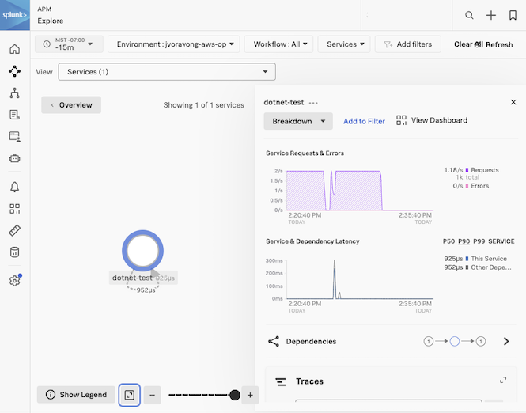

# Example of chart configuration

## How to deploy the OpenTelemetry Operator and .NET auto-instrumentation

In the following example we will show how to instrument a project using
[dotnet-demo](https://raw.githubusercontent.com/signalfx/splunk-otel-collector-chart/main/functional_tests/testdata/dotnet/deployment.yaml).

### 1. Setup the .NET to instrument

The .NET demo will create a dotnet-demo namespace and deploys the related .NET application to it.
If you have your own .NET application you want to instrument, you can still use the steps below as an example for how
to instrument your application.

```bash
kubectl create namespace dotnet-demo
```

```bash
curl https://raw.githubusercontent.com/signalfx/splunk-otel-collector-chart/main/examples/enable-operator-and-auto-instrumentation/dotnet/deployment.yaml | kubectl apply -n dotnet-demo -f -
```

### 2. Complete the steps outlined in [Getting started with auto-instrumentation](../../docs/auto-instrumentation-install.md#steps-for-setting-up-auto-instrumentation)

#### 2.1 Deploy the Helm Chart with the Operator enabled

To install the chart with operator in an existing cluster, make sure you have cert-manager installed and available.
Both the cert-manager and operator are subcharts of this chart and can be enabled with `--set operatorcrds.install=true,operator.enabled=true,certmanager.enabled=true`.
These helm install commands will deploy the chart to the current namespace for this example.

```bash
# Check if a cert-manager is already installed by looking for cert-manager pods.
kubectl get pods -l app=cert-manager --all-namespaces

# If cert-manager is deployed, make sure to remove certmanager.enabled=true to the list of values to set
helm install splunk-otel-collector -f ./my_values.yaml --set operatorcrds.install=true,operator.enabled=true,certmanager.enabled=true,environment=dev splunk-otel-collector-chart/splunk-otel-collector
```

#### 2.2 Verify all the OpenTelemetry resources (collector, operator, webhook, instrumentation) are deployed successfully

<details>
<summary>Expand for kubectl commands to run and output</summary>

```bash
kubectl get pods
# NAME                                                            READY   STATUS             RESTARTS        AGE
# splunk-otel-collector-agent-2mtfn                               2/2     Running            0                5m
# splunk-otel-collector-agent-k4gc8                               2/2     Running            0                5m
# splunk-otel-collector-agent-wjt98                               2/2     Running            0                5m
# splunk-otel-collector-certmanager-69b98cc84d-2vzl7              1/1     Running            0                5m
# splunk-otel-collector-certmanager-cainjector-76db6dcbbf-4625c   1/1     Running            0                5m
# splunk-otel-collector-certmanager-webhook-bc68cd487-dctrf       1/1     Running            0                5m
# splunk-otel-collector-k8s-cluster-receiver-8449bfdc8-hhbvz      1/1     Running            0                5m
# splunk-otel-collector-operator-754c9d78f8-9ztwg                 2/2     Running            0                5m

kubectl get mutatingwebhookconfiguration.admissionregistration.k8s.io
# NAME                                      WEBHOOKS   AGE
# splunk-otel-collector-certmanager-webhook 1          8m
# splunk-otel-collector-operator-mutation   3          2m

kubectl get otelinst
# NAME                    AGE   ENDPOINT
# splunk-otel-collector   5m    http://$(SPLUNK_OTEL_AGENT):4317

kubectl get pods -n dotnet-demo
# NAME                                                        READY   STATUS    RESTARTS   AGE
# dotnet-test-66798c94cc-qmmzv                                1/1     Running   0          2m11s
```

</details>

#### 2.3 Instrument Application by Setting Annotations

When instrumenting your .NET application, specific annotations must be set to correctly of your application.
This section covers how to instrument a .NET deployment, specifically `dotnet-test`, which is a `linux-x64` runtime environment.

.NET auto-instrumentation uses annotations to set the [.NET Runtime Identifiers (RIDs)](https://learn.microsoft.com/en-us/dotnet/core/rid-catalog). There are currently two supported RIDs:

1. **linux-x64**:
   This is the default value and is typically used for most Linux distributions. It can be omitted since it is assumed by default.
  - Annotation: `instrumentation.opentelemetry.io/otel-dotnet-auto-runtime: "linux-x64"`

2. **linux-musl-x64**:
   This should be used specifically for applications running in environments based on the musl library.
  - Annotation: `instrumentation.opentelemetry.io/otel-dotnet-auto-runtime: "linux-musl-x64"`

**Applying the Auto-Instrumentation Annotations:**

The `dotnet-test` app deployed by the `dotnet-test` deployment is a glibc-based application and uses the linux-x64 runtime environment. Therefore, it is appropriate to apply the following annotation.

- Example command:
  ```bash
  kubectl patch deployment dotnet-test -n dotnet-demo -p '{"spec": {"template":{"metadata":{"annotations":{"instrumentation.opentelemetry.io/otel-dotnet-auto-runtime":"linux-x64"}}}} }'
  ```

Once the runtime environment is specified, the next step is to apply the auto-instrumentation annotation. This enables OpenTelemetry to automatically instrument your application.

- For `dotnet-test`, use this command:
  ```bash
  kubectl patch deployment dotnet-test -n dotnet-demo -p '{"spec": {"template":{"metadata":{"annotations":{"instrumentation.opentelemetry.io/inject-dotnet":"default/splunk-otel-collector"}}}} }'
  ```

**Note:**
- This will cause the dotnet-test pod to restart.
- The annotation value "default/splunk-otel-collector" refers to the Instrumentation configuration named `splunk-otel-collector` in the `default` namespace.
- If the chart is not installed in the "default" namespace, modify the annotation value to be "{chart_namespace}/splunk-otel-collector".
- For troubleshooting purposes, examining the logs located in /var/log/opentelemetry/dotnet within the instrumented pod can provide valuable debugging insights.

Remove the annotations to disable instrumentation:

```bash
kubectl patch deployment dotnet-test -n dotnet-demo --type=json -p='[{"op": "remove", "path": "/spec/template/metadata/annotations/instrumentation.opentelemetry.io~1otel-dotnet-auto-runtime"}]'
kubectl patch deployment dotnet-test -n dotnet-demo --type=json -p='[{"op": "remove", "path": "/spec/template/metadata/annotations/instrumentation.opentelemetry.io~1inject-dotnet"}]'
```

You can verify instrumentation was successful on an individual pod with. Check that these bullet points are
true for the instrumented pod using the command below.
- Your instrumented pods should contain an initContainer named `opentelemetry-auto-instrumentation`
- The target application container should have several OTEL_* env variables set that are similar to the output below.

<details>
<summary>Expand for commands to run to verify instrumentation</summary>

```bash
kubectl describe pod -n dotnet-demo -l app=dotnet-test
# Name:             dotnet-test-8499bc67dc-wn2fm
# Namespace:        dotnet-demo
# Labels:           app=dotnet-test
#                   pod-template-hash=8499bc67dc
# Annotations:      instrumentation.opentelemetry.io/inject-dotnet: true
#                   instrumentation.opentelemetry.io/otel-dotnet-auto-runtime: linux-x64
# Status:           Running
# Init Containers:
#   opentelemetry-auto-instrumentation-dotnet:
#     Image:         ghcr.io/signalfx/splunk-otel-dotnet/splunk-otel-dotnet:v1.3.0
#     State:          Terminated
#       Reason:       Completed
#       Exit Code:    0
# Containers:
#   dotnet-test:
#     State:          Running
#     Ready:          True
#     Environment:
#     OTEL_DOTNET_AUTO_PLUGINS:            Splunk.OpenTelemetry.AutoInstrumentation.Plugin, Splunk.OpenTelemetry.AutoInstrumentation
#     OTEL_EXPORTER_OTLP_ENDPOINT:         http://splunk-otel-collector-agent:4318
#     CORECLR_ENABLE_PROFILING:            1
#     CORECLR_PROFILER:                    {918728DD-259F-4A6A-AC2B-B85E1B658318}
#     CORECLR_PROFILER_PATH:               /otel-auto-instrumentation-dotnet/linux-x64/OpenTelemetry.AutoInstrumentation.Native.so
#     DOTNET_STARTUP_HOOKS:                /otel-auto-instrumentation-dotnet/net/OpenTelemetry.AutoInstrumentation.StartupHook.dll
#     DOTNET_ADDITIONAL_DEPS:              /otel-auto-instrumentation-dotnet/AdditionalDeps
#     OTEL_DOTNET_AUTO_HOME:               /otel-auto-instrumentation-dotnet
#     DOTNET_SHARED_STORE:                 /otel-auto-instrumentation-dotnet/store
#     SPLUNK_OTEL_AGENT:                    (v1:status.hostIP)
#     OTEL_SERVICE_NAME:                   dotnet-test
#     OTEL_RESOURCE_ATTRIBUTES_POD_NAME:   dotnet-test-8499bc67dc-wkf98 (v1:metadata.name)
#     OTEL_RESOURCE_ATTRIBUTES_NODE_NAME:   (v1:spec.nodeName)
#     OTEL_PROPAGATORS:                    tracecontext,baggage,b3
#     OTEL_RESOURCE_ATTRIBUTES:            splunk.zc.method=splunk-otel-dotnet:v1.3.0,k8s.container.name=dotnet-test,k8s.deployment.name=dotnet-test,k8s.namespace.name=dotnet-demo,k8s.node.name=$(OTEL_RESOURCE_ATTRIBUTES_NODE_NAME),k8s.pod.name=$(OTEL_RESOURCE_ATTRIBUTES_POD_NAME),k8s.replicaset.name=dotnet-test-8499bc67dc,service.version=latest
#     Mounts:
#       /otel-auto-instrumentation-dotnet from opentelemetry-auto-instrumentation-dotnet (rw)
#       /var/run/secrets/kubernetes.io/serviceaccount from kube-api-access-j5wm6 (ro)
# Volumes:
#   opentelemetry-auto-instrumentation-dotnet:
#     Type:        EmptyDir (a temporary directory that shares a pod's lifetime)
#     Medium:
#     SizeLimit:   200Mi
```

</details>

#### 2.4 Check out the results at [Splunk Observability APM](https://app.us1.signalfx.com/#/apm)


