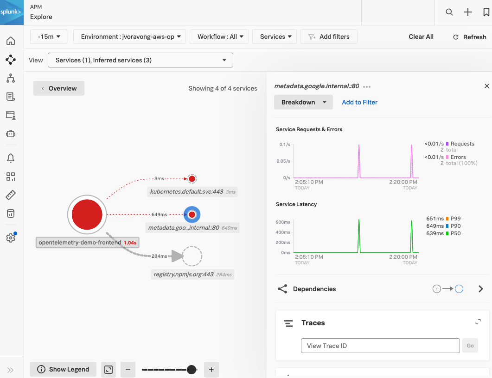

# Example of chart configuration

## How to deploy the OpenTelemetry Operator and NodeJS auto-instrumentation

In the following example we will show how to instrument a project using
[otel-demo](https://raw.githubusercontent.com/signalfx/splunk-otel-collector-chart/main/examples/enable-operator-and-auto-instrumentation/otel-demo/otel-demo.yaml).

### 1. Setup the OpenTelemetry demo to instrument

The NodeJS otel-demo demo will create a otel-demo namespace and deploys the related NodeJS applications to it.
If you have your own NodeJS application you want to instrument, you can still use the steps below as an example for how
to instrument your application.

```bash
curl https://raw.githubusercontent.com/signalfx/splunk-otel-collector-chart/main/examples/enable-operator-and-auto-instrumentation/otel-demo/otel-demo.yaml | kubectl apply -n otel-demo -f -
```

### 2. Complete the steps outlined in [Getting started with auto-instrumentation](../../docs/auto-instrumentation-install.md#steps-for-setting-up-auto-instrumentation)

#### 2.1 Deploy the Helm Chart with the Operator enabled

To install the chart with operator in an existing cluster, make sure you have cert-manager installed and available.
Both the cert-manager and operator are subcharts of this chart and can be enabled with `--set operatorcrds.install=true,operator.enabled=true,certmanager.enabled=true`.
These helm install commands will deploy the chart to the current namespace for this example.

```bash
# Check if a cert-manager is already installed by looking for cert-manager pods.
kubectl get pods -l app=cert-manager --all-namespaces

# If cert-manager is deployed, make sure to remove certmanager.enabled=true to the list of values to set
helm install splunk-otel-collector -f ./my_values.yaml --set operatorcrds.install=true,operator.enabled=true,certmanager.enabled=true,environment=dev splunk-otel-collector-chart/splunk-otel-collector
```

#### 2.2 Verify all the OpenTelemetry resources (collector, operator, webhook, instrumentation) are deployed successfully

<details>
<summary>Expand for kubectl commands to run and output</summary>

```bash
kubectl get pods
# NAME                                                            READY   STATUS             RESTARTS        AGE
# splunk-otel-collector-agent-2mtfn                               2/2     Running            0                5m
# splunk-otel-collector-agent-k4gc8                               2/2     Running            0                5m
# splunk-otel-collector-agent-wjt98                               2/2     Running            0                5m
# splunk-otel-collector-certmanager-69b98cc84d-2vzl7              1/1     Running            0                5m
# splunk-otel-collector-certmanager-cainjector-76db6dcbbf-4625c   1/1     Running            0                5m
# splunk-otel-collector-certmanager-webhook-bc68cd487-dctrf       1/1     Running            0                5m
# splunk-otel-collector-k8s-cluster-receiver-8449bfdc8-hhbvz      1/1     Running            0                5m
# splunk-otel-collector-operator-754c9d78f8-9ztwg                 2/2     Running            0                5m

kubectl get mutatingwebhookconfiguration.admissionregistration.k8s.io
# NAME                                      WEBHOOKS   AGE
# splunk-otel-collector-certmanager-webhooh 1          8m
# splunk-otel-collector-operator-mutation   3          2m

kubectl get otelinst
# NAME                    AGE   ENDPOINT
# splunk-otel-collector   5m    http://$(SPLUNK_OTEL_AGENT):4317

kubectl get pods -n otel-demo
# NAME                                                        READY   STATUS    RESTARTS   AGE
# opentelemetry-demo-frontend-67f5685979-b4ngb                1/1     Running   0          2m11s
```

</details>

#### 2.3 Instrument Application by Setting an Annotation

Apply the instrumentation annotation to instrument the NodeJS deployment `opentelemetry-demo-frontend`:

```bash
kubectl patch deployment opentelemetry-demo-frontend -n otel-demo -p '{"spec": {"template":{"metadata":{"annotations":{"instrumentation.opentelemetry.io/inject-nodejs":"default/splunk-otel-collector"}}}} }'
```

**Note:**
- This will cause the opentelemetry-demo-frontend pod to restart.
- The annotation value "default/splunk-otel-collector" refers to the Instrumentation configuration named `splunk-otel-collector` in the `default` namespace.
- If the chart is not installed in the "default" namespace, modify the annotation value to be "{chart_namespace}/splunk-otel-collector".

Remove the annotation to disable instrumentation:

```bash
kubectl patch deployment opentelemetry-demo-frontend -n otel-demo --type=json -p='[{"op": "remove", "path": "/spec/template/metadata/annotations/instrumentation.opentelemetry.io~1inject-nodejs"}]'
```

You can verify instrumentation was successful on an individual pod with. Check that these bullet points are
true for the instrumented pod using the command below.
- Your instrumented pods should contain an initContainer named `opentelemetry-auto-instrumentation`
- The target application container should have several OTEL_* env variables set that are similar to the output below.

<details>
<summary>Expand for commands to run to verify instrumentation</summary>

```bash
kubectl describe pod -n otel-demo -l app.kubernetes.io/name=opentelemetry-demo-frontend
# Name:             opentelemetry-demo-frontend-57488c7b9c-4qbfb
# Namespace:        otel-demo
# Annotations:      instrumentation.opentelemetry.io/inject-nodejs: default/splunk-otel-collector
# Status:           Running
# Init Containers:
#   opentelemetry-auto-instrumentation:
#     Command:
#       cp
#       -a
#       /autoinstrumentation/.
#       /otel-auto-instrumentation/
#     State:          Terminated
#       Reason:       Completed
#       Exit Code:    0
# Containers:
#   frontend:
#     State:          Running
#     Ready:          True
#     Environment:
#       FRONTEND_PORT:                              8080
#       FRONTEND_ADDR:                              :8080
#       AD_SERVICE_ADDR:                            opentelemetry-demo-adservice:8080
#       CART_SERVICE_ADDR:                          opentelemetry-demo-cartservice:8080
#       CHECKOUT_SERVICE_ADDR:                      opentelemetry-demo-checkoutservice:8080
#       CURRENCY_SERVICE_ADDR:                      opentelemetry-demo-currencyservice:8080
#       PRODUCT_CATALOG_SERVICE_ADDR:               opentelemetry-demo-productcatalogservice:8080
#       RECOMMENDATION_SERVICE_ADDR:                opentelemetry-demo-recommendationservice:8080
#       SHIPPING_SERVICE_ADDR:                      opentelemetry-demo-shippingservice:8080
#       WEB_OTEL_SERVICE_NAME:                      frontend-web
#       PUBLIC_OTEL_EXPORTER_OTLP_TRACES_ENDPOINT:  http://localhost:8080/otlp-http/v1/traces
#       NODE_OPTIONS:                                --require /otel-auto-instrumentation/autoinstrumentation.js
#       SPLUNK_OTEL_AGENT:                           (v1:status.hostIP)
#       OTEL_SERVICE_NAME:                          opentelemetry-demo-frontend
#       OTEL_EXPORTER_OTLP_ENDPOINT:                http://$(SPLUNK_OTEL_AGENT):4317
#       OTEL_RESOURCE_ATTRIBUTES_POD_NAME:          opentelemetry-demo-frontend-57488c7b9c-4qbfb (v1:metadata.name)
#       OTEL_RESOURCE_ATTRIBUTES_NODE_NAME:          (v1:spec.nodeName)
#       OTEL_PROPAGATORS:                           tracecontext,baggage,b3
#       OTEL_RESOURCE_ATTRIBUTES:                   splunk.zc.method=autoinstrumentation-nodejs:0.41.1,k8s.container.name=frontend,k8s.deployment.name=opentelemetry-demo-frontend,k8s.namespace.name=otel-demo,k8s.node.name=$(OTEL_RESOURCE_ATTRIBUTES_NODE_NAME),k8s.pod.name=$(OTEL_RESOURCE_ATTRIBUTES_POD_NAME),k8s.replicaset.name=opentelemetry-demo-frontend-57488c7b9c,service.version=1.5.0-frontend
#     Mounts:
#       /otel-auto-instrumentation from opentelemetry-auto-instrumentation (rw)
# Volumes:
#   opentelemetry-auto-instrumentation:
#     Type:        EmptyDir (a temporary directory that shares a pod's lifetime)
```

</details>

#### 2.4 Check out the results at [Splunk Observability APM](https://app.us1.signalfx.com/#/apm)


