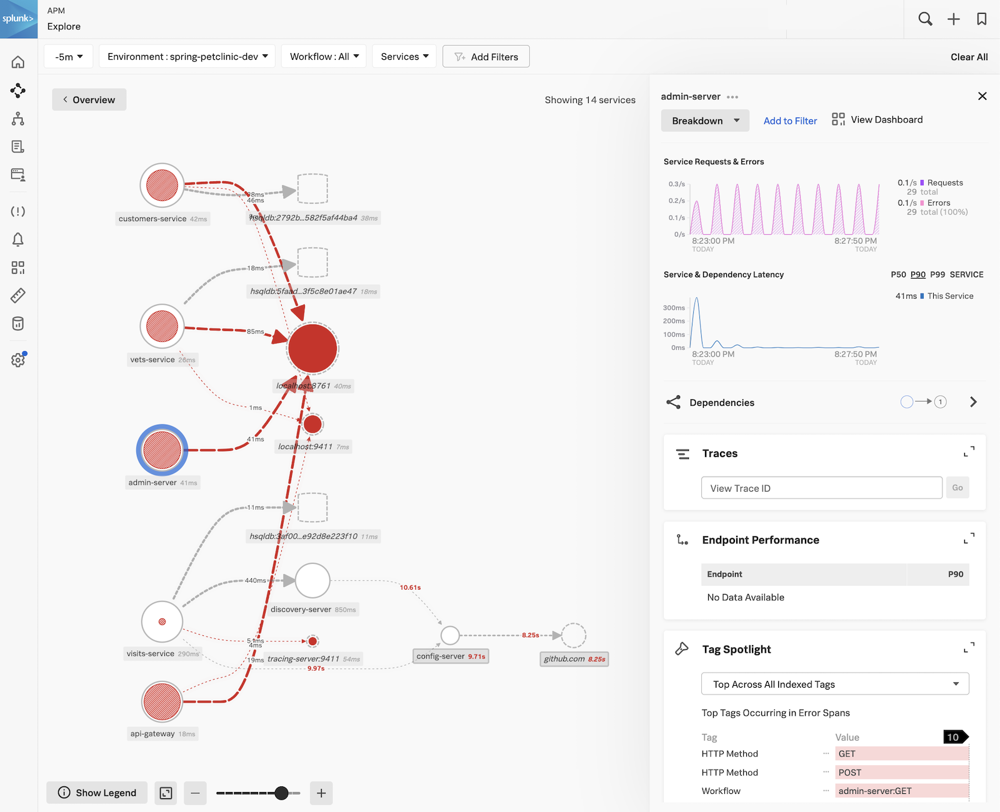

# Example of chart configuration

## How to deploy the OpenTelemetry Operator and Java auto-instrumentation

In the following example we will show how to instrument a project using
[spring-petclinic](https://raw.githubusercontent.com/signalfx/splunk-otel-collector-chart/main/examples/enable-operator-and-auto-instrumentation/spring-petclinic/spring-petclinic.yaml).

### 1. Setup the Spring PetClinic demo to instrument

The Java spring-petclinic demo deploys the related Java applications to the current namespace.
If you have your own Java application you want to instrument, you can still use the steps below as an example for how
to instrument your application.

```bash
curl https://raw.githubusercontent.com/signalfx/splunk-otel-collector-chart/main/examples/enable-operator-and-auto-instrumentation/spring-petclinic/spring-petclinic.yaml | kubectl apply -f -
```

### 2. Complete the steps outlined in [Getting started with auto-instrumentation](../../docs/auto-instrumentation-install.md#steps-for-setting-up-auto-instrumentation)

#### 2.1 Deploy the Helm Chart with the Operator enabled

To install the chart with operator in an existing cluster, make sure you have cert-manager installed and available.
Both the cert-manager and operator are subcharts of this chart and can be enabled with `--set operatorcrds.install=true,operator.enabled=true`.
These helm install commands will deploy the chart to the current namespace for this example.

```bash
helm install splunk-otel-collector -f ./my_values.yaml --set operatorcrds.install=true,operator.enabled=true,environment=dev splunk-otel-collector-chart/splunk-otel-collector
```

#### 2.2 Verify all the OpenTelemetry resources (collector, operator, webhook, instrumentation) are deployed successfully

<details>
<summary>Expand for kubectl commands to run and output</summary>

```bash
kubectl get pods
# NAME                                                            READY   STATUS             RESTARTS        AGE
# splunk-otel-collector-agent-2mtfn                               2/2     Running            0                5m
# splunk-otel-collector-agent-k4gc8                               2/2     Running            0                5m
# splunk-otel-collector-agent-wjt98                               2/2     Running            0                5m
# splunk-otel-collector-k8s-cluster-receiver-8449bfdc8-hhbvz      1/1     Running            0                5m
# splunk-otel-collector-operator-754c9d78f8-9ztwg                 2/2     Running            0                5m
# spring-petclinic-admin-server-55fb6cfc64-gwj8q                  1/1     Running            0                5m
# spring-petclinic-api-gateway-7dfb6f4c88-zstv9                   1/1     Running            0                5m
# spring-petclinic-config-server-55c5d7d69b-hhdn8                 1/1     Running            0                5m
# spring-petclinic-customers-service-65b64444bc-n7b4p             1/1     Running            0                5m
# spring-petclinic-discovery-server-78fbb87b65-tw98n              1/1     Running            0                5m
# spring-petclinic-vets-service-75bc75b8d-sx7gd                   1/1     Running            0                5m
# spring-petclinic-visits-service-7568c748f5-c5jmz                1/1     Running            0                5m

kubectl get mutatingwebhookconfiguration.admissionregistration.k8s.io
# NAME                                      WEBHOOKS   AGE
# splunk-otel-collector-operator-mutation   3          2m

# TODO: Validate these inputs andoutput
kubectl get validatingwebhookconfiguration.admissionregistration.k8s.io
# NAME                                      WEBHOOKS   AGE
# splunk-otel-collector-operator-mutation   3          2m

kubectl get otelinst
# NAME                    AGE   ENDPOINT
# splunk-otel-collector   5m    http://$(SPLUNK_OTEL_AGENT):4317
```

</details>

#### 2.3 Instrument Application by Setting an Annotation

Depending on the variety of applications you are instrumenting, you may want to use different scopes for annotations. This step shows how to annotate namespaces and individual pods.

**Recommended Method**

This is the most recommended way if your applications are of multiple types (like Java, Python, NodeJS) and you want to control annotations at the pod level.

```bash
# Patch all the deployments (labeled with 'app.kubernetes.io/part-of=spring-petclinic) to add the inject annotation.
# This automatically causes pods to restart.
kubectl get deployments -l app.kubernetes.io/part-of=spring-petclinic -o name | xargs -I % kubectl patch % -p "{\"spec\": {\"template\":{\"metadata\":{\"annotations\":{\"instrumentation.opentelemetry.io/inject-java\":\"true\"}}}}}"
```

```bash
# To disable instrumentation, remove the annotation or set its value to 'false'
kubectl get deployments -l app.kubernetes.io/part-of=spring-petclinic -o name | xargs -I % kubectl patch % -p "{\"spec\": {\"template\":{\"metadata\":{\"annotations\":{\"instrumentation.opentelemetry.io/inject-java\":\"false\"}}}}}"
```

**Other Methods**

<details>
<summary>Expand for commands to run to add the annotation at other levels</summary>

##### Namespace Annotation

If all the applications within the target namespace are of one type, annotating the namespace is appropriate.
For example, if you have a namespace called `spring-petclinic` where only Java-based applications run, this could be useful.

```bash
# Annotate the 'spring-petclinic' namespace
kubectl patch namespace spring-petclinic -p '{"metadata":{"annotations":{"instrumentation.opentelemetry.io/inject-java":"true"}}}'
# To apply the changes, you may need to restart the existing pods
kubectl delete --all pods --namespace spring-petclinic
```

```bash
# To disable instrumentation, remove the annotation or set its value to 'false'
kubectl patch namespace spring-petclinic -p '{"metadata":{"annotations":{"instrumentation.opentelemetry.io/inject-java":"false"}}}'
# To apply the changes, you may need to restart the existing pods
kubectl delete --all pods --namespace spring-petclinic
```

##### Deployment Templates

Use this method if you need specific control over which deployments are instrumented.

```bash
# Patch all spring-petclinic deployments
kubectl patch deployment spring-petclinic-admin-server -p '{"spec": {"template":{"metadata":{"annotations":{"instrumentation.opentelemetry.io/inject-java":"true"}}}} }'
kubectl patch deployment spring-petclinic-api-gateway -p '{"spec": {"template":{"metadata":{"annotations":{"instrumentation.opentelemetry.io/inject-java":"true"}}}} }'
kubectl patch deployment spring-petclinic-config-server -p '{"spec": {"template":{"metadata":{"annotations":{"instrumentation.opentelemetry.io/inject-java":"true"}}}} }'
kubectl patch deployment spring-petclinic-customers-service -p '{"spec": {"template":{"metadata":{"annotations":{"instrumentation.opentelemetry.io/inject-java":"true"}}}} }'
kubectl patch deployment spring-petclinic-vets-service -p '{"spec": {"template":{"metadata":{"annotations":{"instrumentation.opentelemetry.io/inject-java":"true"}}}} }'
kubectl patch deployment spring-petclinic-discovery-server -p '{"spec": {"template":{"metadata":{"annotations":{"instrumentation.opentelemetry.io/inject-java":"true"}}}} }'
kubectl patch deployment spring-petclinic-visits-service -p '{"spec": {"template":{"metadata":{"annotations":{"instrumentation.opentelemetry.io/inject-java":"true"}}}} }'
```

```bash
# To disable instrumentation, remove the annotation or set its value to 'false'
kubectl patch deployment spring-petclinic-admin-server -p '{"spec": {"template":{"metadata":{"annotations":{"instrumentation.opentelemetry.io/inject-java":"false"}}}} }'
kubectl patch deployment spring-petclinic-api-gateway -p '{"spec": {"template":{"metadata":{"annotations":{"instrumentation.opentelemetry.io/inject-java":"false"}}}} }'
kubectl patch deployment spring-petclinic-config-server -p '{"spec": {"template":{"metadata":{"annotations":{"instrumentation.opentelemetry.io/inject-java":"false"}}}} }'
kubectl patch deployment spring-petclinic-customers-service -p '{"spec": {"template":{"metadata":{"annotations":{"instrumentation.opentelemetry.io/inject-java":"false"}}}} }'
kubectl patch deployment spring-petclinic-vets-service -p '{"spec": {"template":{"metadata":{"annotations":{"instrumentation.opentelemetry.io/inject-java":"false"}}}} }'
kubectl patch deployment spring-petclinic-discovery-server -p '{"spec": {"template":{"metadata":{"annotations":{"instrumentation.opentelemetry.io/inject-java":"false"}}}} }'
kubectl patch deployment spring-petclinic-visits-service -p '{"spec": {"template":{"metadata":{"annotations":{"instrumentation.opentelemetry.io/inject-java":"false"}}}} }'
```

</details>

You can verify instrumentation was successful on an individual pod with. Check that these bullet points are
true for the instrumented pod using the command below.
- Your instrumented pods should contain an initContainer named `opentelemetry-auto-instrumentation`
- The target application container should have several OTEL_* env variables set that are similar to the output below.

<details>
<summary>Expand for commands to run to verify instrumentation</summary>

```bash
kubectl describe pod spring-petclinic-9d5bc5fff-5r5gr
# Name:             spring-petclinic-9d5bc5fff-5r5gr
# Namespace:        spring-petclinic
# Annotations:      instrumentation.opentelemetry.io/inject-java: true
# Status:           Running
# Init Containers:
#   opentelemetry-auto-instrumentation:
#     Image:         ghcr.io/open-telemetry/opentelemetry-operator/autoinstrumentation-java:1.23.0
#     Command:
#       cp
#       /javaagent.jar
#       /otel-auto-instrumentation/javaagent.jar
#     State:          Terminated
#       Reason:       Completed
#       Exit Code:    0
# Containers:
#   app:
#     State:          Running
#     Ready:          True
#     Environment:
#       SPLUNK_OTEL_AGENT:                    (v1:status.hostIP)
#       OTEL_EXPORTER_OTLP_ENDPOINT:         http://$(SPLUNK_OTEL_AGENT):4317
#       OTEL_TRACES_EXPORTER:                otlp
#       JAVA_TOOL_OPTIONS:                    -javaagent:/otel-auto-instrumentation/javaagent.jar
#       OTEL_SERVICE_NAME:                   spring-petclinic
#       OTEL_RESOURCE_ATTRIBUTES_POD_NAME:   spring-petclinic-9d5bc5fff-5r5gr (v1:metadata.name)
#       OTEL_RESOURCE_ATTRIBUTES_NODE_NAME:   (v1:spec.nodeName)
#       OTEL_PROPAGATORS:                    tracecontext,baggage,b3
#       OTEL_RESOURCE_ATTRIBUTES:            splunk.zc.method=autoinstrumentation-java:v1.28.1,k8s.container.name=app,k8s.deployment.name=spring-petclinic,k8s.namespace.name=spring-petclinic,k8s.node.name=$(OTEL_RESOURCE_ATTRIBUTES_NODE_NAME),k8s.pod.name=$(OTEL_RESOURCE_ATTRIBUTES_POD_NAME),k8s.replicaset.name=spring-petclinic-9d5bc5fff
#     Mounts:
#       /otel-auto-instrumentation from opentelemetry-auto-instrumentation (rw)
```

</details>

#### 2.4 Check out the results at [Splunk Observability APM](https://app.us1.signalfx.com/#/apm)



